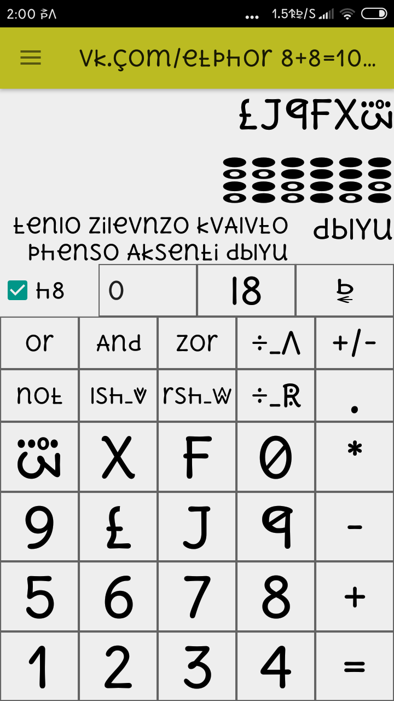
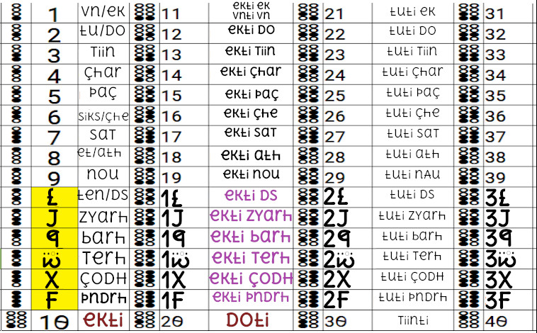
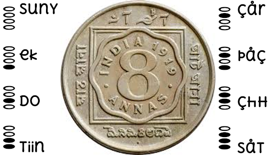
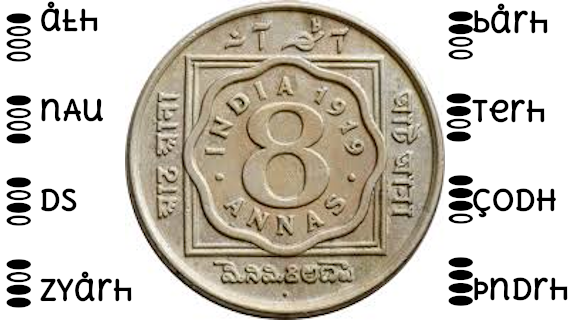
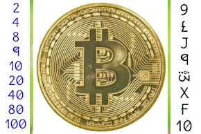

### hexadecimal dizital progrmming calculator
### हेक्साडेसिमल डिजिटल प्रोग्रामिंग कैलकुलेटर

isko install krne ke liye [heksuletr Android apk daunlod](daunlod/heksuletr.apk) kiziye. Aur fir daunlod hone ke bAD Android ke Download folder me zakr instal kiziye. ye heksuletr Apke Android mobile me instal ho zayega. isko
open krenge Toh yh niche photo me h vAise Dikhega.

इसको इनस्टॉल करने के लिए [हेक्सलेटर एंड्राइड अपक डाउनलोड](daunlod/heksuletr.apk) कीजिये. और फिर डाउनलोड होने के बाद एंड्राइड के डाउनलोड फोल्डर में जाकर इंस्टाल कीजिये.ये हेक्सलेटर आपके एंड्राइड मोबाइल में इंस्टाल हो जाएगा. इसको
ओपन करेंगे तोह यह नीचे फोटो में है वैसे दिखेगा.

is mATths ke bare me kuch photoz h zinki sHayTa se yum(you) hexadecimal sAmAzh payeNge.

